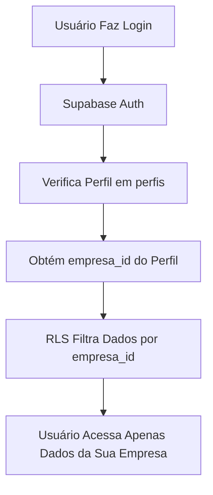
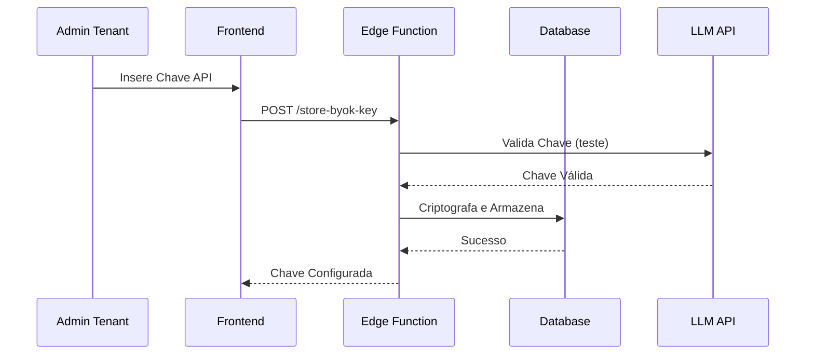
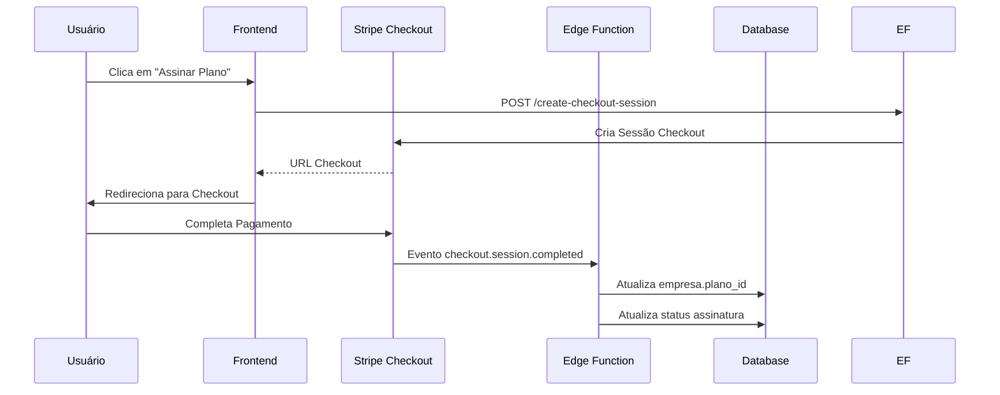

# Arquitetura do ControlAI

## Visão Geral

O ControlAI é uma plataforma SaaS multi-tenant construída com **Vite/React** no frontend e **Supabase** como backend (PostgreSQL + Edge Functions). O sistema implementa isolamento completo de dados entre tenants usando **Row-Level Security (RLS)** e um modelo de negócio **BYOK (Bring Your Own Key)** para integração com LLMs.

## Stack Tecnológica

- **Frontend:** React 18 + TypeScript + Vite
- **UI:** Shadcn UI (baseado em Radix UI) + Tailwind CSS
- **Roteamento:** React Router DOM
- **Backend:** Supabase (PostgreSQL + Edge Functions)
- **Autenticação:** Supabase Auth
- **Pagamentos:** Stripe (Checkout + Webhooks)
- **E-mails:** Brevo (API)
- **LLM:** OpenAI/Claude (via chaves BYOK dos clientes)
- **Deploy:** Netlify (Frontend) + Supabase (Backend)

## Estrutura de Diretórios

```
controlai-aulas/
├── src/
│   ├── components/          # Componentes React reutilizáveis
│   │   ├── ui/              # Componentes Shadcn UI
│   │   ├── auth/            # Componentes de autenticação
│   │   ├── dashboard/       # Componentes de dashboards
│   │   └── ...
│   ├── pages/               # Páginas/rotas da aplicação
│   │   ├── auth/            # Login, Register
│   │   ├── dashboard/       # Dashboards (Master, Admin, Colaborador)
│   │   └── ...
│   ├── lib/                 # Lógica de baixo nível
│   │   ├── supabase/        # Cliente Supabase e tipos
│   │   └── utils.ts         # Utilitários
│   ├── contexts/            # Context Providers React
│   ├── hooks/               # Custom Hooks
│   └── ...
├── supabase/
│   ├── migrations/           # Migrations SQL do banco
│   └── functions/            # Edge Functions
├── docs/                     # Documentação
└── ...
```

## Arquitetura Multi-tenant

### Isolamento de Dados

O isolamento entre tenants é garantido através de **Row-Level Security (RLS)** do Supabase. Todas as tabelas que contêm dados de tenants possuem uma coluna `empresa_id` que é usada nas políticas RLS.

**Princípio Fundamental:** Um usuário autenticado só pode acessar dados da sua própria empresa (`empresa_id`), exceto usuários com role `master` que têm acesso a todas as empresas.

### Fluxo de Autenticação Multi-tenant



### Tabelas com Isolamento Multi-tenant

- `empresas` - Dados da empresa (tenant)
- `perfis` - Colaboradores (vinculados a `empresa_id`)
- `agentes_ia` - Agentes IA da empresa
- `conversas` - Histórico de chats
- `uso_recursos` - Métricas de uso por empresa
- `auditoria` - Logs (com `empresa_id` opcional para master)

## Modelo BYOK (Bring Your Own Key)

### Conceito

O ControlAI utiliza um modelo híbrido de monetização:
- **Plataforma cobra:** Taxa de serviço SaaS (via Stripe)
- **Cliente fornece:** Sua própria chave API de LLM (OpenAI/Claude)

### Fluxo BYOK



### Segurança de Chaves

1. **Criptografia:** Chaves são criptografadas usando `pgcrypto` antes de serem armazenadas
2. **Acesso:** Chaves descriptografadas apenas em Edge Functions (server-side)
3. **Nunca expostas:** Chaves nunca são retornadas ao cliente
4. **Validação:** Chave é validada fazendo uma chamada de teste à API do LLM antes de armazenar

## Políticas RLS (Row-Level Security)

### Estrutura de Políticas

Todas as políticas seguem o padrão:

```sql
-- Exemplo: Política SELECT para tabela agentes_ia
CREATE POLICY "Usuários veem apenas agentes da sua empresa"
ON agentes_ia FOR SELECT
USING (
  empresa_id IN (
    SELECT empresa_id FROM perfis WHERE id = auth.uid()::bigint
  )
  OR EXISTS (
    SELECT 1 FROM perfis 
    WHERE id = auth.uid()::bigint AND role = 'master'
  )
);
```

### Roles e Permissões

- **master:** Acesso a todas as empresas (apenas para dono da plataforma)
- **admin:** Acesso completo à sua empresa (criar/editar/deletar colaboradores, configurar BYOK, etc.)
- **user:** Acesso limitado (chat, visualizar agentes, etc.)

## Edge Functions

### Quando Usar Edge Functions

Use Edge Functions para:
- Operações que requerem `service_role` (bypass RLS)
- Operações sensíveis (criptografia, validação de chaves)
- Integrações externas (Stripe, Brevo, LLM APIs)
- Validação de permissões complexas

**NUNCA** use Edge Functions para operações simples de CRUD que podem ser feitas diretamente pelo cliente com RLS.

### Estrutura de Edge Functions

```
supabase/functions/
├── provision-tenant/        # Cria empresa + perfil após sign-up
├── store-byok-key/          # Armazena chave API criptografada
├── invoke-llm/              # Invoca LLM com chave BYOK
├── stripe-webhooks/         # Processa eventos do Stripe
├── create-member/           # CRUD de colaboradores
└── ...
```

### Validação em Edge Functions

Todas as Edge Functions devem:
1. Validar entrada com `zod`
2. Verificar autenticação via `supabase.auth.getUser()`
3. Verificar permissões (role, empresa_id)
4. Registrar ações em `auditoria` quando aplicável

## Fluxo de Assinatura Stripe



## Controle de Limites de Uso

### Tracking Automático

Após cada mensagem enviada no chat:
1. Edge Function `invoke-llm` retorna tokens consumidos
2. Edge Function `track-usage` atualiza `uso_recursos`
3. Validação contra `planos.limite_mensagens_mes`

### Bloqueio de Uso

Se limite excedido:
- Chat bloqueado
- Mensagem de upgrade exibida
- Link para upgrade no Stripe

## Segurança

### Princípios

1. **Nunca confie no cliente:** Validações sempre no servidor (Edge Functions)
2. **RLS sempre habilitado:** Todas as tabelas com dados de tenant têm RLS
3. **Criptografia de dados sensíveis:** Chaves API sempre criptografadas
4. **Auditoria completa:** Todas as ações administrativas são logadas
5. **Rate Limiting:** 100 requests/minuto por tenant

### Variáveis de Ambiente

- **Frontend:** Apenas `VITE_SUPABASE_URL` e `VITE_SUPABASE_ANON_KEY`
- **Edge Functions:** Secrets configurados no Supabase Dashboard
  - `SUPABASE_SERVICE_ROLE_KEY`
  - `STRIPE_SECRET_KEY`
  - `BREVO_API_KEY`

## Convenções de Código

### Nomenclatura

- **Diretórios:** kebab-case (`auth-wizard`, `dashboard-admin`)
- **Componentes:** PascalCase (`UserProfile.tsx`)
- **Funções:** camelCase (`getUserProfile`)
- **Constantes:** UPPER_SNAKE_CASE (`MAX_RETRIES`)

### Estrutura de Componentes

```typescript
// 1. Imports externos
import { useState } from 'react';

// 2. Imports internos
import { Button } from '@/components/ui/button';

// 3. Tipos/Interfaces
interface Props {
  // ...
}

// 4. Componente principal
export function Component({ ... }: Props) {
  // ...
}

// 5. Subcomponentes
function SubComponent() {
  // ...
}

// 6. Helpers
function helperFunction() {
  // ...
}
```

## Próximos Passos

Após a conclusão do Épico 0, os próximos épicos implementarão:
- Épico 1: Autenticação Multi-tenant e RLS
- Épico 2: Dashboards Tenant e Master
- Épico 3: Integração Stripe + BYOK
- Épico 4: Gestão Segura de Chaves LLM
- Épico 5: Chat Colaborador
- Épico 6: Observabilidade e E-mails

